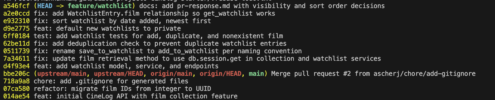

# PR Response Doc — CineLog Watchlist Feature

## AI Usage
> Orientation and scaffolding: I used AI to summarize the existing collection_service.py and test patterns before writing watchlist code, and to scaffold the structure of this pr-response.md.
> Code and verification: I used AI to help mirror the add_to_collection() deduplication pattern in add_to_watchlist(), draft the tests/test_watchlist.py cases, and check that my commit messages followed Conventional Commits format before the interactive rebase.
> Stress-testing the design decisions (Comments 4 and 5): I wrote my positions first, then asked AI what counterarguments a reviewer would raise and what tradeoff I hadn't acknowledged. The core decisions were mine — private-by-default (Comment 4) and date-added sort (Comment 5). The AI's contribution was pushback, not reasoning: for Comment 4 it pointed out I should concede the loss of discovery/social value in a community app, and for Comment 5 it noted that alphabetical is genuinely better for finding a specific title in a long list. I folded those tradeoff acknowledgements in, but the arguments for why private and date-added fit CineLog are my own.

---

## Comment 1 — Rename `save_to_watchlist` → `add_to_watchlist`

**What I did:**
Renamed `save_to_watchlist()` to `add_to_watchlist()` in `services/watchlist_service.py`
to follow the project's `verb_to_noun` naming convention (matching `add_to_collection()`).
Updated both call sites in `routes/watchlist/watchlist.py` — the import and the function call.

**How I verified:**
Ran `git grep -n save_to_watchlist`, which returned no results, confirming every reference
was updated. `pytest tests/` still passed.

---

## Comment 2 — Deduplication

**What I did:**
Added deduplication to `add_to_watchlist()`, mirroring the pattern in `add_to_collection()`:
after confirming the film exists, query for an existing `WatchlistEntry` with the same
`user_id` and `film_id`, and raise a new `AlreadyInWatchlistError` if one is found instead
of inserting a duplicate. Wired the route to return HTTP 409 for that error (and 404 for a
nonexistent film, which the route previously did not handle).

**How I verified:**
Compared against `add_to_collection()`'s `filter_by(...).first()` check to match the existing
pattern. Added a duplicate-entry test (see Comment 3) that asserts the second add raises and
that only one entry exists in the database.

---

## Comment 3 — Missing test

**What I did:**
Created `tests/test_watchlist.py`, modeled on `tests/test_collection.py` (same in-memory app
fixture, same user/film fixtures). Added the required test for a nonexistent `film_id`
(`test_add_to_watchlist_nonexistent_film_raises`), plus a happy-path test and a duplicate test
to satisfy CONTRIBUTING.md's requirement of happy-path / duplicate / nonexistent coverage for
a new service function.

**How I verified:**
Ran `pytest tests/ -v` — all tests pass.

---

## Comment 4 — Default visibility

> Reviewer (@dev-lead): "I notice watchlists default to `public=True`. We don't have a
> documented decision on default visibility for user lists. Before I can approve this, I need
> you to add a note to your PR description explaining your reasoning. I want to make sure we're
> being intentional here, not just inheriting a default."

**My position:**
> New watchlists default to private (public=False) - I deliberately flipped it; sharing is opt-in 

**Reasoning:**
> "what I'm planning to watch" more personal/revealing than "what I've watched". A watchlist is intent — films you haven't seen yet - which should not be broadcasted
> A safe default is the one that can't expose a user without them choosing to. You can always opt to share later; you can't un-expose something people already saw.

**Tradeoff acknowledged:**
> In a community app, private-by-default kills discovery and serendipity. Friends can't see what you're planning to watch, so you lose social recommendations and the network effect that arguably makes CineLog valuable

---

## Comment 5 — Sort order

> Reviewer (@dev-lead): "I'd prefer watchlists to default to 'date added' order rather than
> alphabetical. Most users want to see what they added recently. I'm open to discussion if you
> see it differently — but let's make a decision and document it."

**My position:**
> I agree with the reviewer and switched the code from Film.title.asc() to WatchlistEntry.date_added.desc(), so the watchlist now returns newest-added first

**Reasoning:**
> date-added is right for CineLog specifically because you likely care more about the thing you just added instead of a film starting with "A". Also, the collection already sorts newest-first. So, if watchlist sorts alphabetically, the two sibling features will behave inconsistenylu for no reason. 

**Engagement with reviewer's point:**
> I agree. Most users would want to see what they added recently and would help with consistency with sibling features.

---

## Comment 6 — Rebase

**What conflicted:**
While this PR was open, a refactor merged to `main` that migrated film IDs from auto-increment
integers to UUID strings (`db.String(36)`). My watchlist branch predated that change, so
`git rebase origin/main` produced a conflict in `models.py`: `main` had no `WatchlistEntry`
class at all, while my branch added one whose `film_id` column was still `db.Integer` referencing
`film.id` — inconsistent with the now-UUID `Film.id` and `CollectionEntry.film_id`.

**How I resolved it:**
I kept my `WatchlistEntry` class and changed its foreign key from
`film_id = db.Column(db.Integer, db.ForeignKey("film.id"))` to
`film_id = db.Column(db.String(36), db.ForeignKey("film.id"))` so it matches the UUID scheme the
rest of the models now use, preserving my `public=False` default from Comment 4. I also updated
the now-stale type references in the docstrings (`add_to_watchlist` in the service and the route
body comment) from `int` to UUID string.

**How I verified no conflict remains:**
After removing all conflict markers I ran `git add models.py` and `git rebase --continue`; the
remaining commits replayed cleanly. `git status` is clean, `pytest tests/ -v` passes all 8 tests
against the UUID code, and `git log --oneline` shows a linear history with no merge commits
(`git log --merges origin/main..HEAD` returns nothing).

---

## git log --oneline (final history)

Final `feature/watchlist` history after the Milestone 4 interactive rebase — nine
conventional commits, one logical change each, rebased onto `origin/main` with no merge commits:

---

## PR Description

**What the watchlist feature does:**
The watchlist lets a user save films they want to watch later, kept separate from their
collection of films already watched. Users can add a film to their watchlist and view the
list back; adding the same film twice is rejected rather than silently duplicated, and each
entry carries a visibility flag. It adds a `WatchlistEntry` model, an `add_to_watchlist` /
`get_watchlist` service, and two REST endpoints: `POST /watchlist/<user_id>/add` and
`GET /watchlist/<user_id>`.

**Design decisions:**

1. **Default visibility (Comment 4):** new watchlists default to **private** (`public=False`);
   sharing is opt-in. A watchlist is aspirational intent rather than history, so it isn't
   broadcast unless the user chooses to.
2. **Sort order (Comment 5):** `get_watchlist` returns entries by **date added, newest first**
   (`WatchlistEntry.date_added.desc()`), matching how the collection already sorts.

